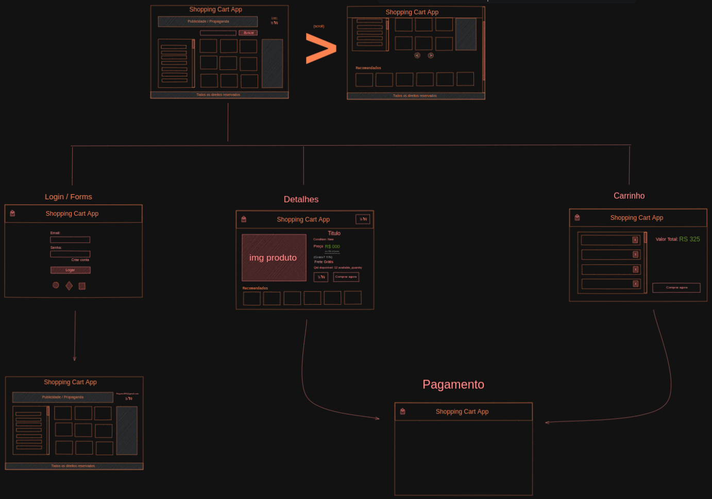

# Boas vindas ao repositório do projeto Shopping Cart! 🛒💨

>## SUMÁRIO

  - [O que será desenvolvido](#o-que-será-desenvolvido)
  - [Imagens do Projeto](#protótipo-do-projeto)
  - [API Shopping Cart](#api-shopping-cart)
  - [Caso queira contribuir:](#antes-de-começar-a-desenvolver)
  - [Dicas durante o desenvolvimento](#durante-o-desenvolvimento)
---

>## Sobre

- Nesse projeto, você será capaz de:

  - Fazer requisições a uma API *(Application Programming Interface)* do Mercado Livre e montar o seu carrinho de compras :D

---

>## O que será desenvolvido

- Nesse projeto consiste em montar um **carrinho de compras** totalmente dinâmico! E o melhor: consumindo dados diretamente de uma **API!** Isso mesmo. Da sigla em inglês _Application Programming Interface_, uma API é um ponto de contato na internet com determinado serviço. Através de **requisições HTTP** a essa API é possível interagir com ela da forma como quem a criou planejou. Aqui usaremos a API do Mercado Livre para buscarmos produtos à venda.

---

>## Imagem do Projeto

---

>## API Shopping Cart

- O [manual da API do Mercado Livre](https://developers.mercadolivre.com.br/pt_br/itens-e-buscas) contém muitas informações sobre ela.
- Utilizaremos alguns dos _endpoints_, e a forma de uso está detalhada no manual.

---

>## Caso queira contribuir:

1. Clone o repositório
  * `git clone git@github.com:LuisCarlosCruz/carrinho-de-compras.git`.
  * Entre na pasta do repositório que você acabou de clonar:
    * `cd carrinho-de-compras`

2. Instale as dependências e inicialize o projeto
  * Instale as dependências:
    * `npm install`
  * Inicialize o projeto:
    * `npm start` (uma nova página deve abrir no seu navegador com um texto simples)

3. Crie uma branch a partir da branch `master`
  * Verifique que você está na branch `master`
    * Exemplo: `git branch`
  * Se não estiver, mude para a branch `master`
    * Exemplo: `git checkout master`
  * Agora, crie uma branch onde você vai guardar os commits do seu projeto

---

>## Dicas durante o desenvolvimento

* Faça `commits` das alterações que você fizer no código regularmente;

* Lembre-se de sempre após um ~~(ou alguns)~~ `commits` atualizar o repositório remoto (o famoso `git push`);

* Os comandos que você utilizará com mais frequência são:

  1. `git status` _(para verificar o que está em vermelho - fora do stage - e o que está em verde - no stage)_;

  2. `git add` _(para adicionar arquivos ao stage do Git)_;

  3. `git commit` _(para criar um commit com os arquivos que estão no stage do Git)_;

  4. `git push -u nome-da-branch` _(para enviar o commit para o repositório remoto na primeira vez que fizer o `push` de uma nova branch)_;

  5. `git push` _(para enviar o commit para o repositório remoto após o passo anterior)_.

---
